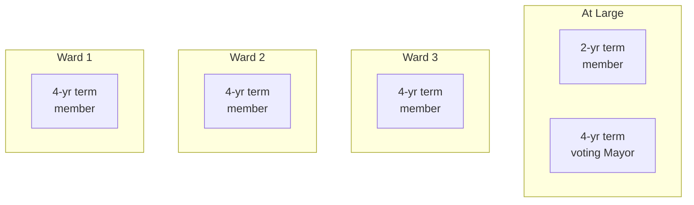
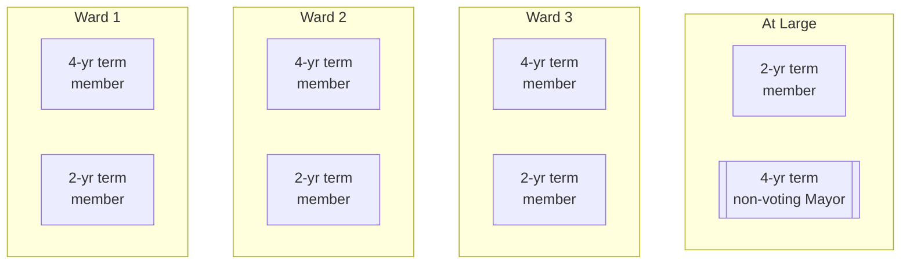
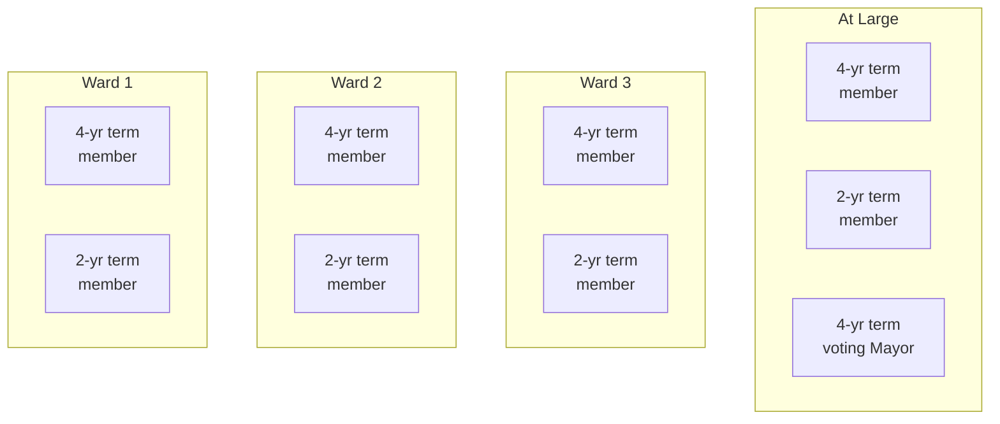
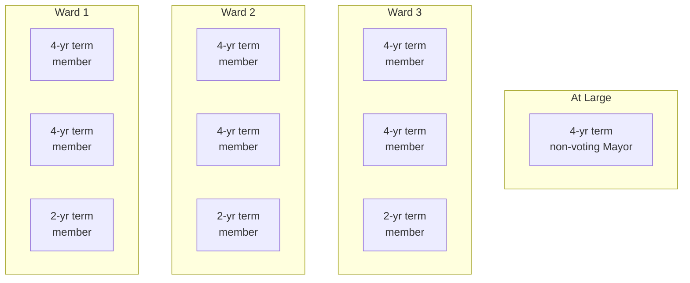
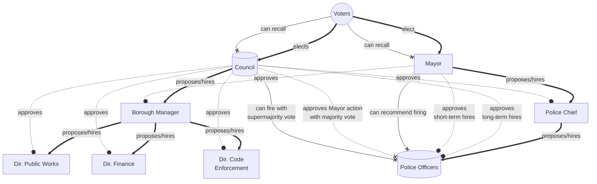
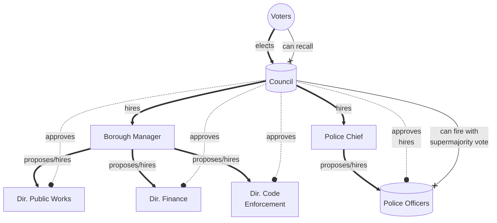

# Notes and musings on a Home Rule Charter for Wilkinsburg

:warning: This needs to be completed to be taken seriously. It's incomplete as of 2023-09-15.
I am not an expert; I have opinions on government structure that I believe drive toward
accountability, transparency, and meaningful consensus with clear redress for grievances.

## Representation

Ideally, every citizen should have at least two council members representing them.
This allows for one vacancy per ward so that the people always have representation.
To alleviate the possibility of a two-person vacancy, at least one at-large Council member is desirable.

### Wards

Retaining Wilkinsburg's three wards seems sensible.
I find reason to neither split further nor consolidate into a single body.

### Council member terms and limits

A four-year term is appropriate.
A two-year term for some members enables shorter commitment and a higher velocity of change.
This encourages the Council to establish codified norms, not dynasties.

A Council member should be limited to ten consecutive years in office.
This enables a person to win a 2-year seat and then seek re-election twice or some combination thereof.
This enables a short commitment to start followed by productive years or a long commitment upfront with a short term to pass off to the next generation.

A term-limited former Council member may seek election to Council after waiting as many years as they were in office.
This will normally be ten years.
This encourages the development of a culture of continuous re-engagement, not sole ownership of roles.

### Number of Council Members, including potential voting Mayor

The count should be at least five and no more than nine.
To enable equal representation for the wards, in some scenarios, it becomes ideal to afford the Mayor a vote.
Alternatively, another Council member with a four-year term may work, but it may enable one ward to dominate.
Avoid that.

Council members and the Mayor are expected to be present at all major public meetings.
Absences are acceptable but trigger a replacement process at five excused or three unexcused absences.

**A replacement process is to be determined.** Possibly,
An automatic recall vote at the next primary or general election.
A successful recall triggers a special election no sooner than 30 days and no later than 90 days.

#### Five Council Members

All wards have dedicated representation, plus one short-term at-large member and the mayor voting.
In this, the mayor is effectively the president of the Council.
However, the mayor should not be responsible for determining what matters the Council considers.
That should be left to the Council to decide, perhaps with an elected Vice President from the four Council members.

#### Seven Council members

At seven, the best structure is simply to add a short-term Council member to each ward and not afford the Mayor a vote.
This structure is the best to avoid any one ward having quorum and control.
The Council will vote among themselves for President and Vice President.

#### Eight Council Members & Voting Mayor

This is the least desirable structure because it may give one ward quorum and control.
Even affording the Mayor only a tie-breaking vote does not avoid that.

#### Nine Council Members, non-voting Mayor

The Council members choose a President and Vice President among themselves.
This is Wilkinsburg's way as of 2023, except that Wilkinsburg in 2023 does not require the Mayor to be present.

## Council / Mayor Oversight on Borough Operations

### Scenario 1: Council & Mayor

This structure is similar to what Wilkinsburg has as of 2023.

Notable features:

* It gives the Council oversight on all hiring decisions at the department director level and the police 
* It gives the Mayor power to make emergency decisions regarding police.
* It gives elected officials the power to dismiss police officers.

### Scenario 2: Council only

In this scenario, the Council retains its power to remove police officers but gains the power to remove the police chief.

## Budgeting & Taxation

The Council must publish a balanced budget proposal by October 1 annually.

Any tax decrease of greater than 5% must be approved through a referendum.
This is to encourage oversight and responsible budgeting.
It may seem like a no-brainer for voters to approve, but the intent is to force voters to think about _why_ their taxes are decreasing
and to prepare them for the possibility that taxes might increase within a few years of decreasing.

All tax increases must be ratified through a referendum, except when immediately following a decrease.
For an increase of any income or property tax,
a simple majority of voters is required for passage of increases of less than two percent,
while a supermajority of voters is required for passage of increases of two percent or more.

If the Council decreases a tax rate for one year and then raises the tax rate to up to the rate before the decrease, no referendum is required.
Through this mechanism, the Council can respond to economic conditions by lowering taxes for one year and restoring them without public approval.
Wilkinsburg taxpayers could assume that any tax adjustment is permanent after two years.

## Unionization

The borough council, mayor, and borough manager must not discourage unionization or union activity of borough government employees.
The borough government charter must require that all union contracts are public.
Any member of the public should have standing to force the government or the union employees to abide by the public contract.
Any union contract to be approved must be published for review for at least 28 days before it can be voted on, but Council may require a longer review period.
